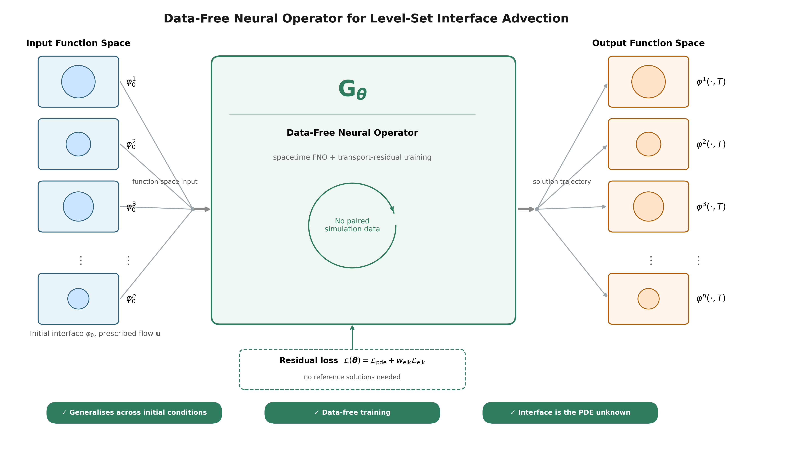
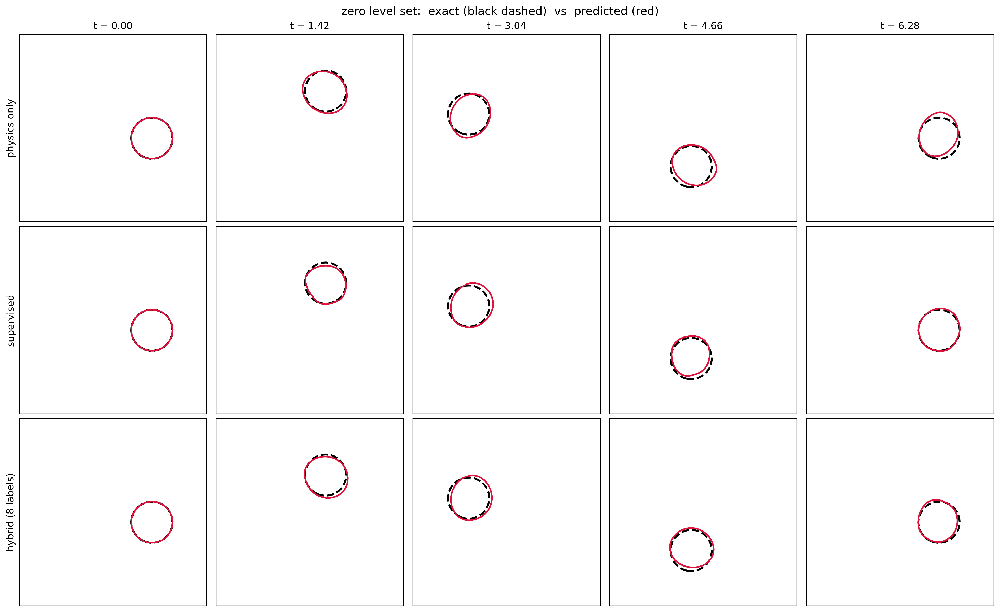
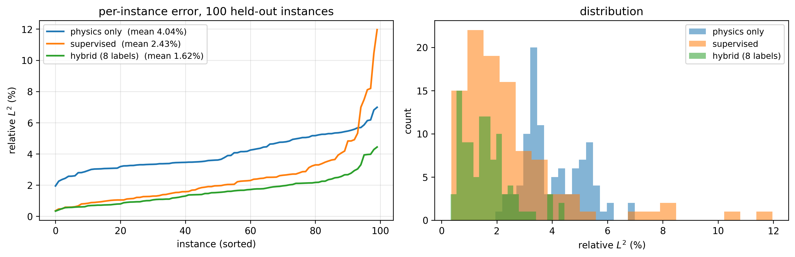
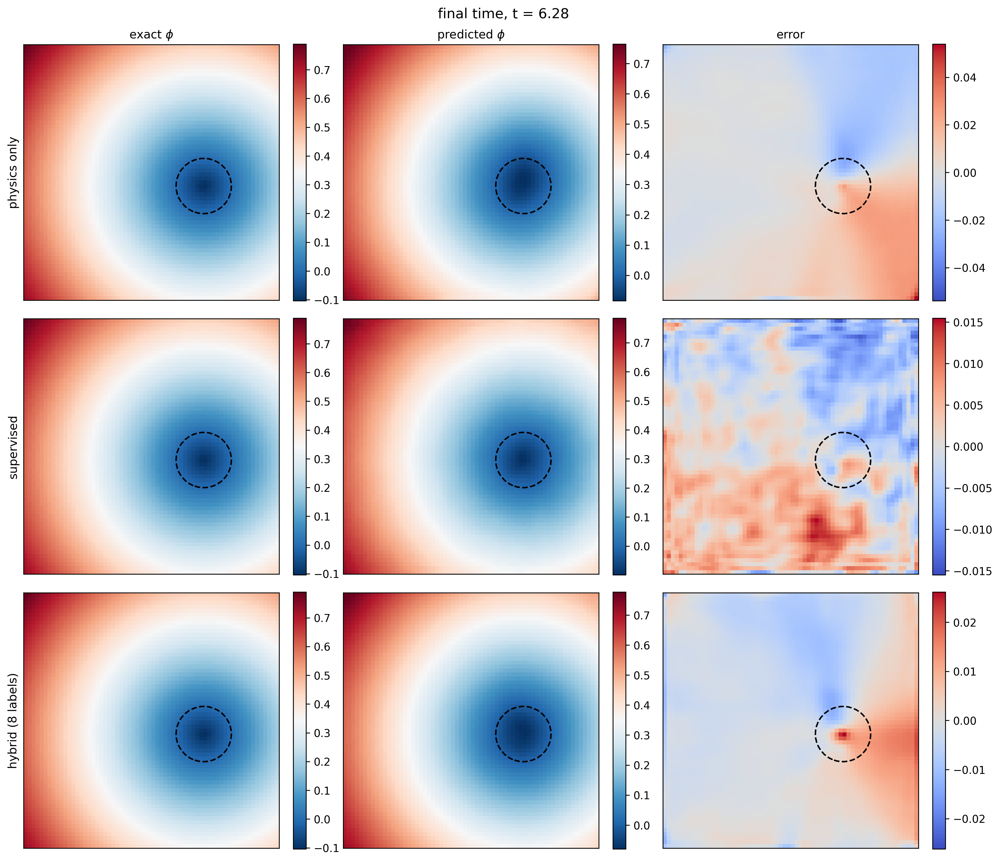
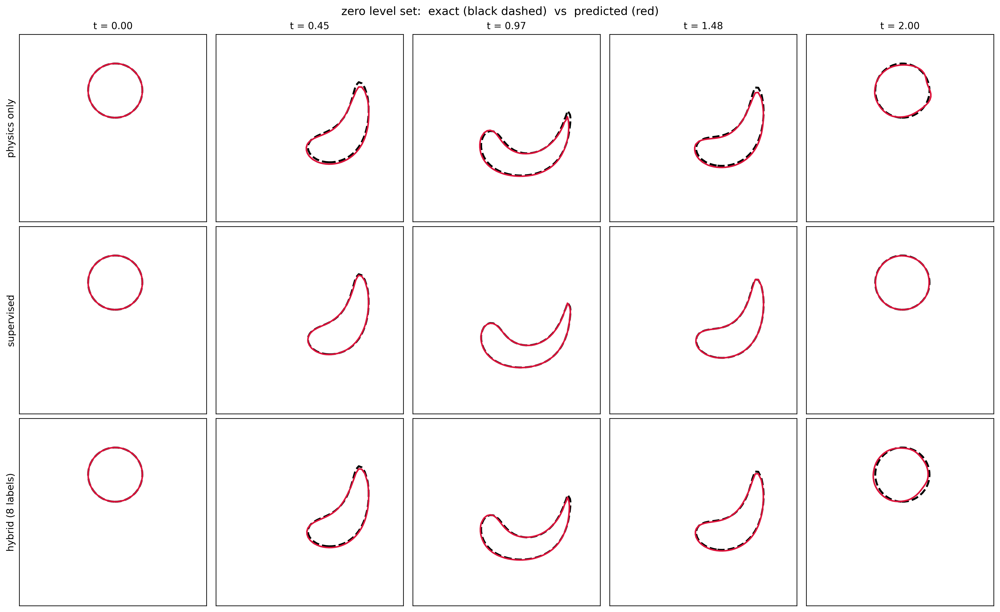
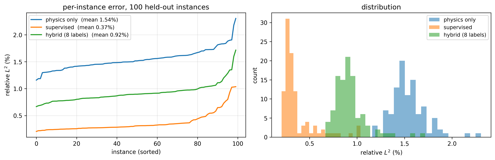
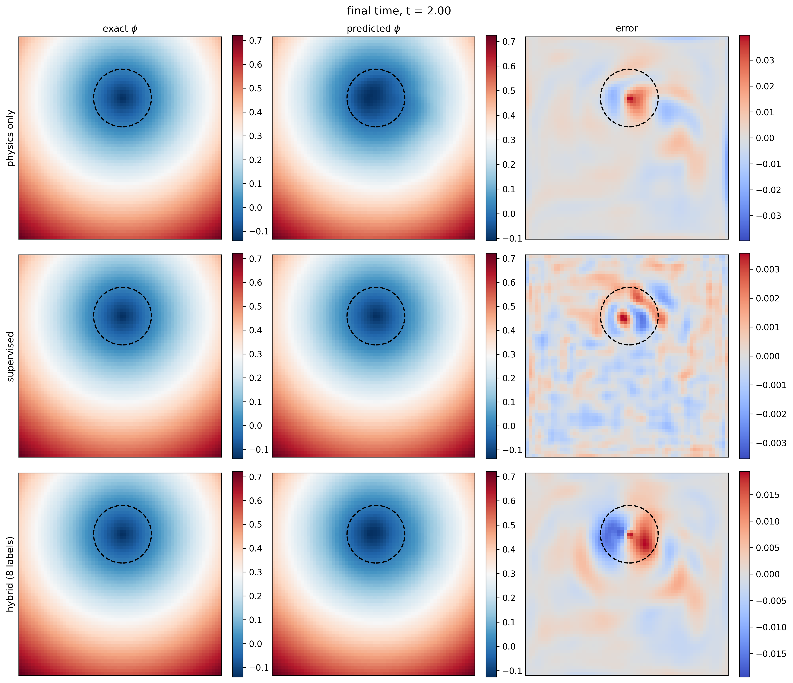

# A Data-Free Physics-Informed Neural Operator for Level-Set Interface Advection

[](https://python.org)
[](https://pytorch.org)
[](LICENSE)

> Code for a **neural operator for level-set interface advection trained
> without reference solutions**. Where
> [`pinn-level-set`](https://github.com/AkbarTheAnalyst/pinn-level-set)
> (Khan & Raees, *Machine Learning: Science and Technology*, 2026,
> [doi:10.1088/2632-2153/ae8b74](https://doi.org/10.1088/2632-2153/ae8b74))
> fits one initial configuration at a time, this work learns the solution map
> over a family of them, so a new interface costs a single forward pass rather
> than a complete retraining. The eikonal weighting is
> [SAW](https://github.com/AkbarTheAnalyst/pinn-level-set-3d-saw)
> (arXiv:2608.08322), with the one modification a structurally imposed initial
> condition requires.

---

## Overview

A neural operator approximates the solution map of a PDE rather than one
solution. For level-set advection

$$\frac{\partial \phi}{\partial t} + \mathbf{u}\cdot\nabla\phi = 0, \qquad \mathbf{x}\in\Omega=[0,1]^2$$

the map takes an initial interface to the full spatiotemporal trajectory under
a prescribed flow. Existing operators for interfacial problems are trained on
reference solutions produced by the solver they are intended to replace. This
one is trained on the transport residual and a geometric constraint alone; no
reference solution enters the objective at any point.

This repository contains:

1. **A data-free operator**: spacetime Fourier backbone emitting the entire
   trajectory in one pass, with the initial condition imposed by construction
   rather than by penalty, trained on

$$\mathcal{L}_{\text{pde}} + w_{\text{eik}}\,\mathcal{L}_{\text{eik}}$$

2. **Supervised and hybrid baselines** under an identical architecture, family,
   optimisation budget and test set, quantifying what refusing labels costs.
   These are baselines, not proposed methods.

3. **Two benchmarks chosen at opposite ends of one axis**: how far the exact
   solution departs from a signed-distance function — since that is what
   determines whether the geometric constraint helps.

4. **Area-based measures alongside the field norm**, because the two order the
   arms differently and reporting either alone misrepresents the comparison.

**Key findings:**
- Training without any reference solution reaches $1.614 \pm 0.067\%$ relative
  $L_2$ on 100 held-out interfaces for the reversed vortex, against
  $0.369 \pm 0.035\%$ for the supervised baseline, a factor of $4.4$. On
  solid-body rotation the same comparison is $3.804 \pm 1.075\%$ against
  $2.576 \pm 0.159\%$, a factor of $1.5$.
- The two benchmarks rank the three arms differently, and the eikonal
  constraint accounts for it: the exact solution violates
  $\lVert\nabla\phi\rVert = 1$ over $0.3$% of the domain under rotation and
  $86.9$% under the vortex.
- Where the constraint is valid, the physics-trained operator conserves
  enclosed area $2.7$ times better than supervision on solution data, despite a
  larger field error; the two arms fail in different ways, not by different
  amounts.
- On the same benchmark, eight reference solutions combined with the residual
  outperform sixteen without it. The ordering is not monotone in the label
  count.
- SAW's weight seeding assumes a soft initial condition. Under a structural one
  the field begins at an exact distance function, the ratio is uninformative at
  the first iteration, and seeding the moving average at zero rather than at
  that ratio is sufficient; the gate, quantile, ratio and clamp are unchanged.
- Rotation required $30{,}000$ Adam iterations where the vortex converged by
  $20{,}000$. The difference tracks the eikonal weight, which stays active on
  one benchmark and is suppressed to $O(10^{-4})$ on the other.

---

## Benchmarks

Two benchmarks on the unit square $\Omega=[0,1]^2$, chosen for how far their
exact solution departs from a signed-distance function.

| Benchmark | Description | $T$ | Domain violating $\lVert\nabla\phi\rVert=1$ | Adam iters |
|---|---|---|---|---|
| **RO** — Solid-body rotation | Rigid, closed-form solution | $2\pi$ | $0.3\%$ | $30{,}000$ |
| **RV** — Reversed single vortex | Deforming, reverses at $T/2$; references by backward characteristics | $2$ | $86.9\%$ | $20{,}000$ |

In both, the velocity field is held fixed and the initial interface varies over
a family drawn by Latin hypercube — the single-input-function protocol used
throughout the operator literature.

### Results (mean ± std over 3 seeds, 100 held-out instances)

**RO — solid-body rotation, $30{,}000$ iterations**

| Arm | Labels | rel. $L_2$ (%) | area error (%) | drift (%) |
|---|---|---|---|---|
| Data-free | $0$ | 3.804 ± 1.075 | **3.15 ± 0.49** | 3.28 ± 0.47 |
| Hybrid | $8$ | **1.599 ± 0.084** | 3.42 ± 0.28 | 3.54 ± 0.29 |
| Supervised | $16$ | 2.576 ± 0.159 | 8.61 ± 0.97 | 8.91 ± 0.99 |
| Exact solution | — | 0 | 0 | 0.82 |

**RV — reversed vortex, $20{,}000$ iterations**

| Arm | Labels | rel. $L_2$ (%) | area error (%) | drift (%) |
|---|---|---|---|---|
| Data-free | $0$ | 1.614 ± 0.067 | 3.57 ± 0.79 | 3.68 ± 0.78 |
| Hybrid | $8$ | 0.986 ± 0.081 | 2.73 ± 0.56 | 2.83 ± 0.60 |
| Supervised | $16$ | **0.369 ± 0.035** | **1.13 ± 0.10** | **1.50 ± 0.13** |
| Exact solution | — | 0 | 0 | 1.09 |

The ordering is monotone in the label count on RV and is not on RO. Area error
is measured against the reference field with identical counting on both sides,
so its discretisation floor is zero by construction. Drift is measured against
the prediction's own initial area and requires no reference; the Exact solution
rows give the discretisation floor for each benchmark.

---

## Architecture & Training

One architecture across both benchmarks and all three arms. Only the loss
differs between arms.

```
Input:  (phi_0, u_1, u_2, x, y, t_norm) on a 64 x 64 x 32 spacetime grid
  -> Linear lift to width 20
  -> 4 x [SpectralConv3d(12, 12, 8) + Conv3d(1x1) -> GELU]
  -> Linear(128) -> GELU -> Linear(1)
Output: phi = phi_0 + (t/T) * N_theta      (initial condition exact by construction)
```

| Hyperparameter | Value |
|---|---|
| Grid | $64\times64\times32$ over $\Omega\times[0,T]$ |
| Latent width | 20 |
| Retained Fourier modes | $(12, 12, 8)$ |
| Fourier layers | 4 |
| Parameters | $7.38\times10^6$ |
| Training instances | 16 (initial interfaces; no solutions) |
| Test instances | 100, held out |
| Optimiser | Adam, batch 4, cosine $10^{-3}\!\rightarrow\!10^{-5}$, grad-norm clip 1 |
| Iterations | $30{,}000$ (RO), $20{,}000$ (RV) |
| **SAW** $\beta$, $q$, seeding | $0.999$, $0.95$, **zero** |
| $\lambda_\text{data}$ (hybrid) | 1, on half the training instances |
| Seeds | 42, 43, 44 |

No second-stage optimiser. A refinement stage that helps one arm more than
another would confound the comparison, so every arm is Adam only.

All runs on a single NVIDIA T4: roughly 45 min per $20{,}000$ iterations.

---

## Embedded Figures (GitHub preview)

- The operator map:

  

- RO — zero level set, three arms:

  

- RO — per-instance error over the held-out set:

  

- RO — field and signed error at the final time:

  

- RV — zero level set, three arms:

  

- RV — per-instance error over the held-out set:

  

- RV — field and signed error at the final time:

  

---

## Installation

```bash
git clone https://github.com/AkbarTheAnalyst/data-free-neural-operator-level-set.git
cd data-free-neural-operator-level-set
pip install -r requirements.txt
```

---

## Repository Structure

```
data-free-neural-operator-level-set/
├── src/                   # benchmark families, model, losses, tooling
│   ├── ro_family.py       # rotation: exact solution, family, metrics
│   ├── rv_family.py       # vortex: characteristics, family, metrics
│   ├── residuals.py       # transport residual, eikonal term, SAW
│   ├── fno3d.py           # spacetime FNO + structural initial condition
│   ├── train_operator.py  # training, all three arms
│   ├── eval_checkpoint.py # train/test metrics on matched instances
│   ├── visualize.py       # interfaces, fields, per-instance spread
│   ├── collect_results.py # results table with seed statistics
│   ├── plot_weights.py    # eikonal-weight trajectory diagnostics
│   └── verify_residual.py # residual consistency check
├── notebooks/             # one per benchmark, every cell runnable
├── results/               # run configs and full evaluation histories
│   ├── ro/
│   └── rv/
├── figures/
├── requirements.txt
├── LICENSE
└── README.md
```

`results/` holds the `.json` produced by each run — arguments, the full
evaluation history, and per-instance errors on the held-out set. Every table
and figure in the paper is reproduced from these. Model weights are not
included; they are regenerated by rerunning the notebooks.

---

## Reproducing the results

Run from `src/` with the result files alongside, or open the notebooks, which
contain the same commands. The notebooks were run on Colab, so their first two
cells (`drive.mount(...)`, `%cd /content/drive/MyDrive/NORO`/`NORV`) are
Colab/Drive-specific — delete or replace those two cells with a plain `cd` into
your own clone of `src/` and every other cell runs unedited.

**Data-free, rotation, three seeds**

```bash
python train_operator.py --loss strong --saw --saw_init zero \
    --steps 30000 --n_train 16 --n_test 100 --seed 42
```

**Supervised baseline**

```bash
python train_operator.py --loss supervised \
    --steps 30000 --n_train 16 --n_test 100 --seed 42
```

**Hybrid, eight of sixteen labelled**

```bash
python train_operator.py --loss strong --saw --saw_init zero --n_labelled 8 \
    --steps 30000 --n_train 16 --n_test 100 --seed 42
```

For the vortex, add `--benchmark rv` and use `--steps 20000`. The first vortex
run traces the backward characteristics and caches them; subsequent runs reuse
the cache.

**Budget sensitivity (RO only, 20,000 vs. 30,000 iterations)**

Table `budget` in the paper compares RO at both budgets, all other settings
identical. The `30000` runs above are one side of it; the other side is the
same three commands (data-free, supervised, hybrid) at `--steps 20000`:

```bash
python train_operator.py --loss strong --saw --saw_init zero \
    --steps 20000 --n_train 16 --n_test 100 --seed 42   # and seeds 43, 44

python train_operator.py --loss supervised \
    --steps 20000 --n_train 16 --n_test 100 --seed 42   # and seeds 43, 44

python train_operator.py --loss strong --saw --saw_init zero --n_labelled 8 \
    --steps 20000 --n_train 16 --n_test 100 --seed 42   # and seeds 43, 44
```

**Tables and figures**

```bash
python collect_results.py --sort test
python eval_checkpoint.py <tag> --n_test 100
python visualize.py <data-free tag> <supervised tag> <hybrid tag> \
    --n_test 100 --instance 54
```

`--instance` fixes which held-out member is drawn, so figures are comparable
across arms and runs. Index 54 (RO) and 63 (RV) were chosen because all three
arms sit within a few percent of their own means there.

---

## References

- Osher, S., & Sethian, J. A. (1988). Fronts propagating with
  curvature-dependent speed. *Journal of Computational Physics*, 79(1), 12–49.
- Zalesak, S. T. (1979). Fully multidimensional flux-corrected transport
  algorithms for fluids. *Journal of Computational Physics*, 31(3), 335–362.
- Sussman, M., Smereka, P., & Osher, S. (1994). A level set approach for
  computing solutions to incompressible two-phase flow. *Journal of
  Computational Physics*, 114(1), 146–159.
- Li, Z., et al. (2021). Fourier neural operator for parametric partial
  differential equations. *ICLR*.
- Li, Z., et al. (2024). Physics-informed neural operator for learning partial
  differential equations. *ACM/IMS Journal of Data Science*, 1(3), 1–27.
- Lu, L., et al. (2021). Learning nonlinear operators via DeepONet. *Nature
  Machine Intelligence*, 3(3), 218–229.
- Eshaghi, M. S., et al. (2025). Variational physics-informed neural operator
  (VINO) for solving partial differential equations. *CMAME*.
- Zhu, B., et al. (2026). Weak-form physics-informed neural operator for
  variable domains.
- Sukumar, N., & Srivastava, A. (2022). Exact imposition of boundary conditions
  with distance functions in physics-informed deep neural networks. *CMAME*,
  389, 114333.
- Khan, M. A., & Raees, F. (2026). A systematic study of physics-informed
  neural networks for the level-set interface advection. *Machine Learning:
  Science and Technology*. doi:10.1088/2632-2153/ae8b74.
- Khan, M. A. (2026). SDF-Aware Weighting: adaptive eikonal regularisation for
  three-dimensional level-set physics-informed neural networks.
  arXiv:2608.08322.

(Full reference list in [main_manuscript/references.bib](../main_manuscript/references.bib).)

---

## Citation

```bibtex
@misc{khan2026datafreeoperator,
  author = {Muhammad Akbar Khan},
  title  = {A Data-Free Physics-Informed Neural Operator for Level-Set
            Interface Advection},
  year   = {2026},
  url    = {https://github.com/AkbarTheAnalyst/data-free-neural-operator-level-set}
}
```

---

## Author

**Muhammad Akbar Khan**
MS Applied Mathematics, NED University of Engineering & Technology
akbar.bsma1337@gmail.com · [GitHub](https://github.com/AkbarTheAnalyst) ·
[ORCID 0009-0001-7956-0080](https://orcid.org/0009-0001-7956-0080) ·
[Website](https://akbarkhan.dev)
